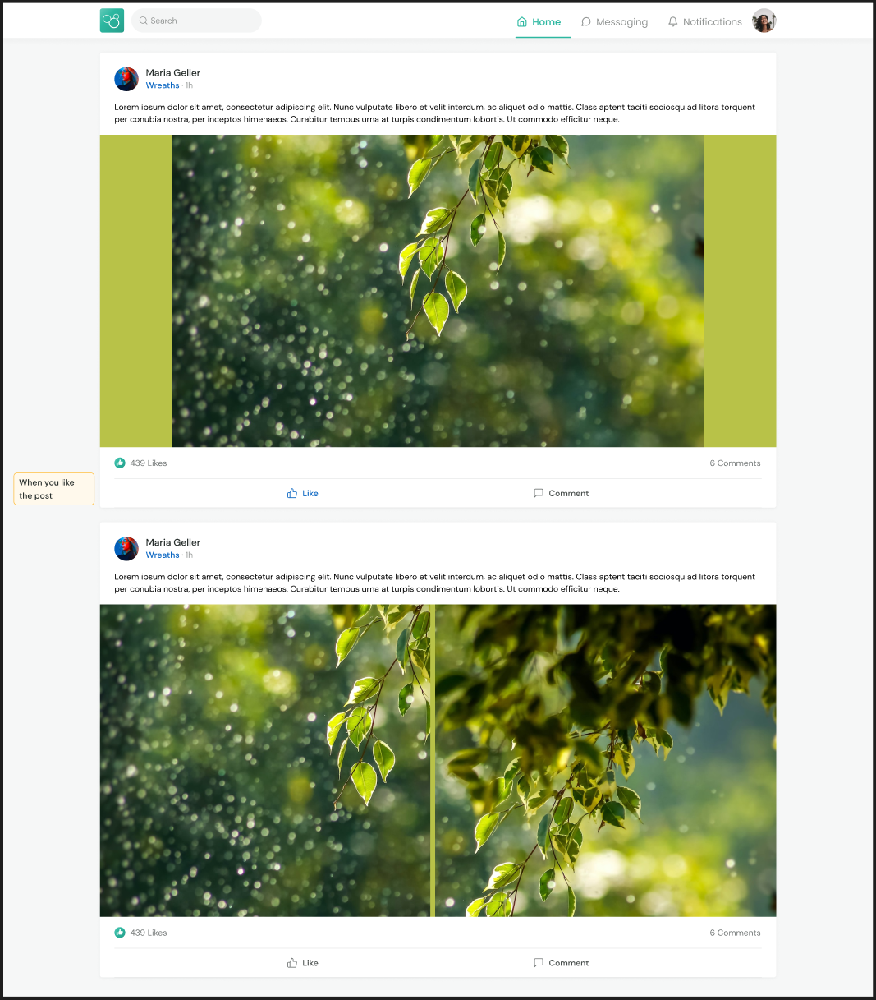

# Tedooo Feed - Home Assignment

This project implements a feed UI for the Tedooo platform using **React**, bootstrapped with **Vite** for a fast and
modern development experience. The application adheres to the provided design specifications and functionality
requirements, as outlined in the Figma design.

### [Live Demo](https://lidorc145.github.io/tedooo-home-assignment/)

### Features

1. **Infinite Scrolling:**

    - Fetches and displays feed items in batches of 6, ensuring seamless continuous scrolling.
    - Stops loading when the API indicates no more items to fetch (`hasMore: false`).

2. **Feed Item Details:**

    - Displays the following details for each post:
        - **User Name**
        - **Shop Name**
        - **Post Text**
        - **Post Images** (up to 2 images if available)
        - **Total Likes** and **Total Comments**
        - Interactive **Like** and **Comment** buttons

3. **Interactive Features:**

    - Users can like and unlike posts.
    - The like count updates in real time to reflect the current status.

### Bonus Features

1. **Impression Tracking:**
    - Tracks and sends a one-time impression event when a post is viewed by the user.
    - Ensures each impression is sent only once per post, leveraging local storage to avoid duplicates.

### Tech Stack

- **React 18.3.1**: Frontend library for building the user interface.
- **Redux Toolkit**: Manages global state, including feed data, pagination, and user interactions.
- **Vite**: Modern build tool for a fast and optimized development environment.
- **TailwindCSS**: Utility-first CSS framework for styling.
- **Framer Motion**: Adds smooth animations and transitions to the UI.

### Libraries Used

- **@reduxjs/toolkit**: State management for handling feed data and interactions.
- **react-redux**: Connects Redux state to React components.
- **framer-motion**: Adds animations and smooth transitions.
- **tailwindcss**: Simplifies CSS styling with utility-first classes.
- **vite-plugin-svgr**: Handles SVG imports as React components.
- **gh-pages**: Deploys the application to GitHub Pages.



### Folder Structure

```
src/
├── assets/          # Static assets like images and fonts
├── components/      # Reusable UI components (e.g., FeedItem, LoadingBar)
├── App.tsx          # Root component
├── index.jsx        # Entry point
app/                 # Redux slices and state management
public/              # Static public files
```

### API Usage

- Fetch feed data:

    - Base URL: `https://backend.tedooo.com/hw/feed.json`
    - Pagination: Use the `skip` parameter to load items in batches of 6.

  Example:

  ```bash
  https://backend.tedooo.com/hw/feed.json?skip=6
  ```

- Impression tracking:

  ```bash
  https://backend.tedooo.com/?itemId={id}
  ```

### Scripts

- `npm run dev`: Start the development server.
- `npm run build`: Build the project for production.
- `npm run deploy`: Build and deploy the application to GitHub Pages.

### Author

This project was developed as part of a home assignment. For questions or feedback, please feel free to reach out!

