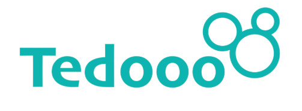

# Tedooo Feed

We are adding a feed to our platform 🎉
Your task is to create the feed UI using TypeScript and React.
 

## Project Resources
All design elements and measurements can be found in the Figma project:
Figma Design - Tedooo Feed

## our Task: Build the Feed UI
Using the provided resources, build a feed interface that allows users to:
1. View Feed Items
   ○ Implement infinite scrolling to load and display all feed items
   continuously as the user scrolls down.

2. Feed Item Details
   Each feed item should include:
   ○ User name
   ○ Shop name
   ○ Post text
   ○ Post images - up to 2 images if available
   ○ Total likes and Total comments
   ○ Like and Comment buttons
3. Interactive Features

○ Implement the ability to like and unlike posts.
■ The like icon should reflect the current status
(liked/unliked).
■ Update the total likes count in real time as the user
interacts.

## API Information
### ● Data
Access the feed data in JSON format from:
https://backend.tedooo.com/hw/feed.json
### ● Pagination
Load feed items in sets of 6. Use the skip parameter to manage
pagination (e.g., after loading the first 6 items, call
https://backend.tedooo.com/hw/feed.json?skip=6). The API will
return a hasMore value to indicate whether there are more items to
load. When hasMore is false, stop making further requests.
## Bonus Task
If you'd like to go above and beyond, consider implementing the following:
### ● Impression Tracking
Each time a user views a feed item, send a one-time impression
request to: https://backend.tedooo.com/?itemId={id}
### ● (Replace {id} with the feed item's unique identifier.)
Note: Ensure that each impression is sent only once per feed item.

